# PetTrack
Swift Course - Final Project

PetTrack app support better communication between veterinary hospitals or private clinics to their customers.
The application was built as part of the final project of the application development course for iOS.
The application was built in xcode with swift and connected to Firebase for data management.

## Screenshots
### Main, Login and Sign Up screens
Authentication was performed using firebase authentication and the personal data was saved using firebase firestore.

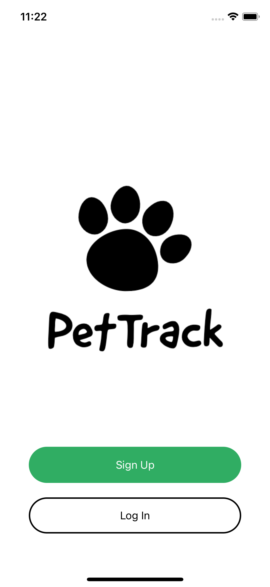 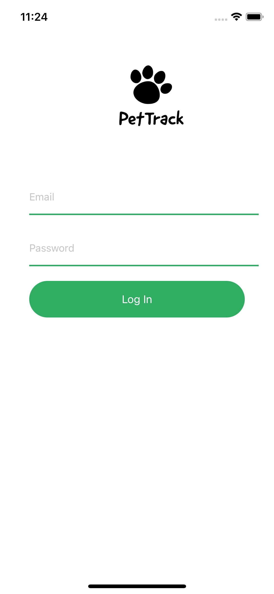 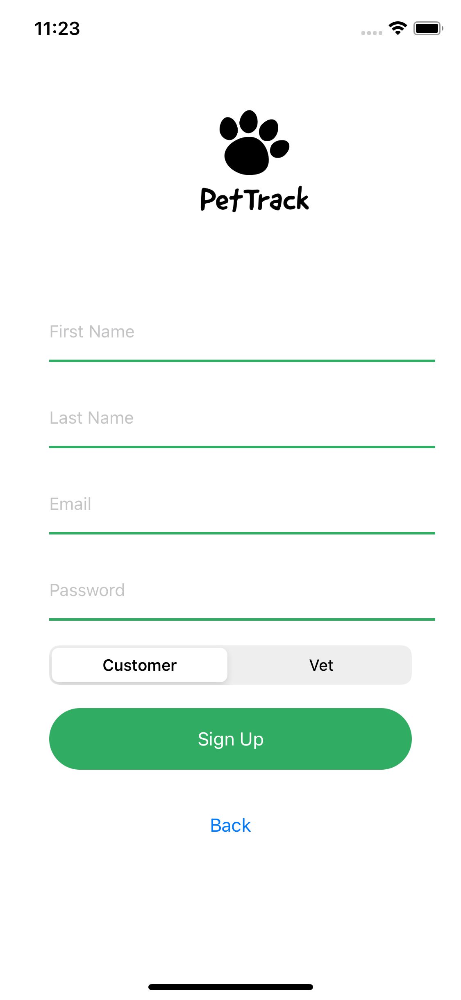

### Customer Tabs
Home screen that shows all the existing pets in the system. You can see the details of the pets.

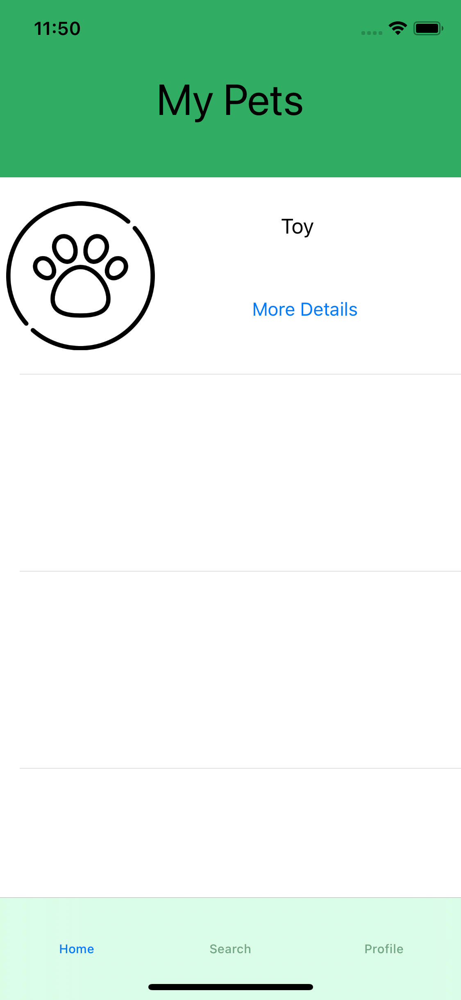 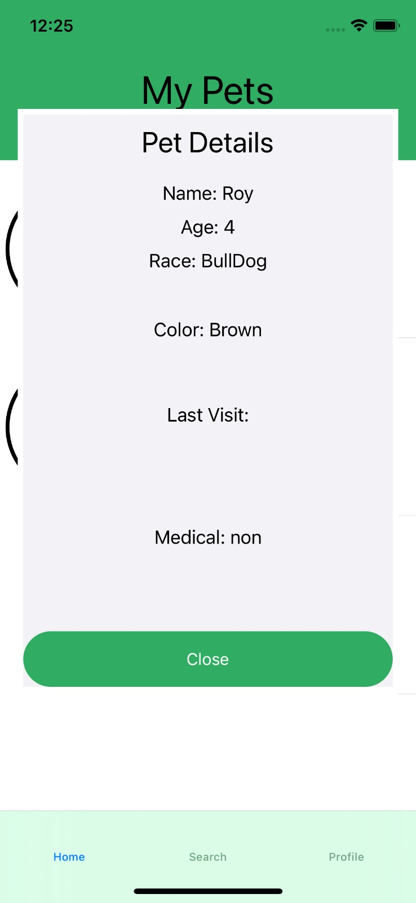 

Search screen that shows all the existing vets in the system. You can see the details of the vets.

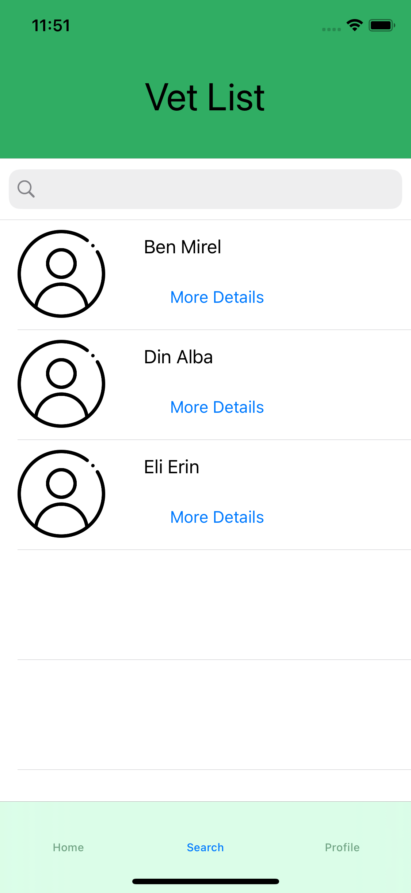 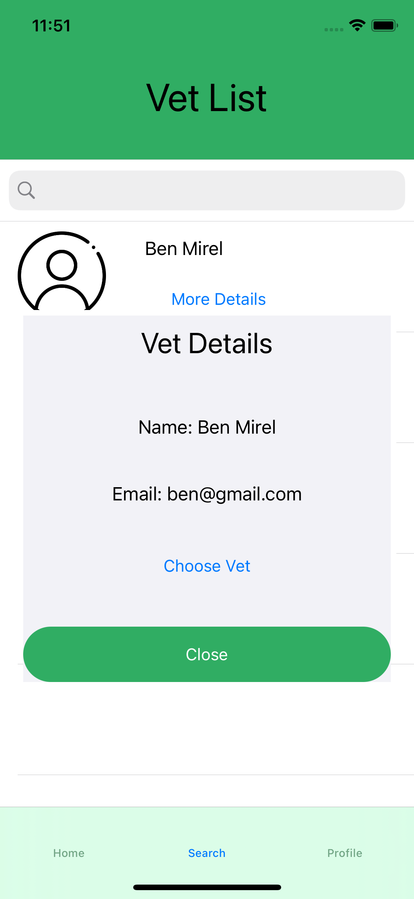 

Profile screen that shows all user's information. You can also add a new pet.

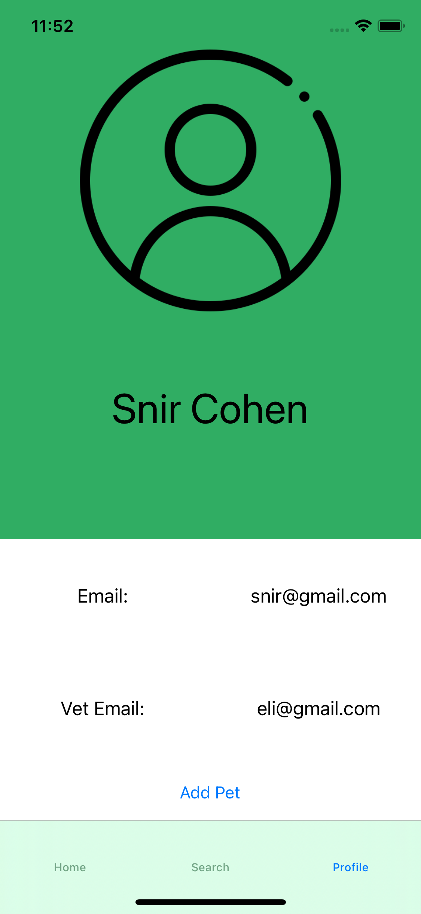 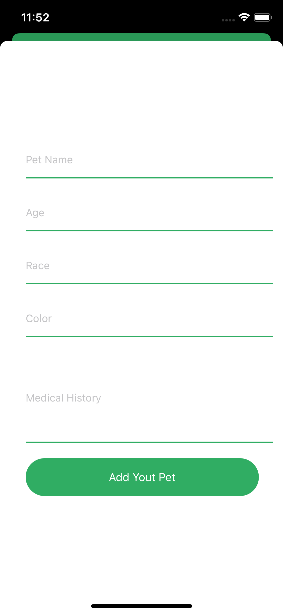 

### Vet Tabs
Home screen that shows all the existing customers in the system. You can see the details of the customer.

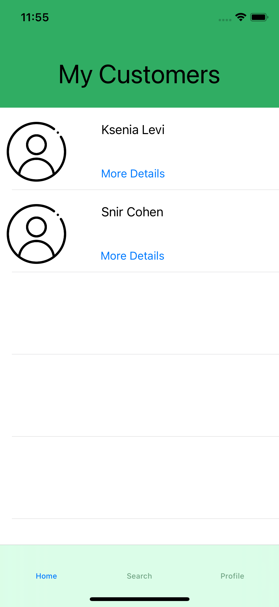 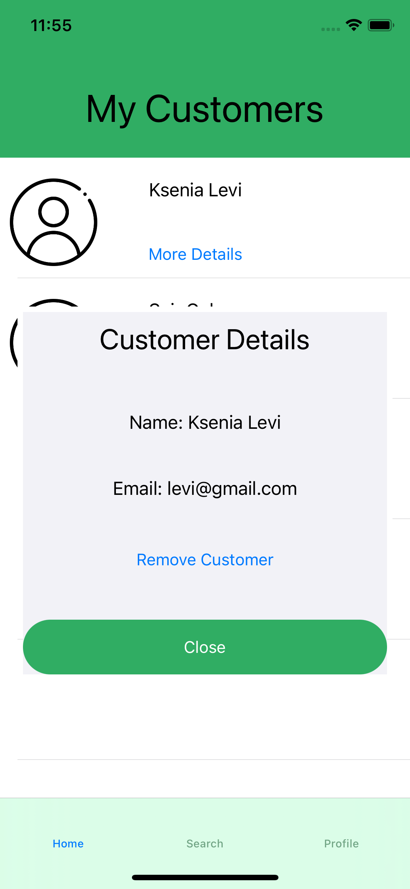 

Search screen that shows all the existing pets in the system that under this vet's care. You can see the details of the pets and edit them.

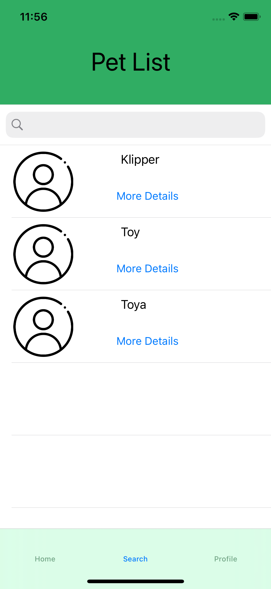  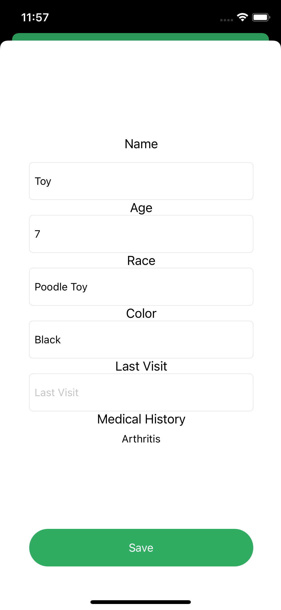 

Profile screen that shows all vet's information.

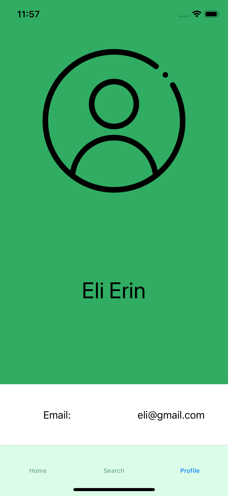 

